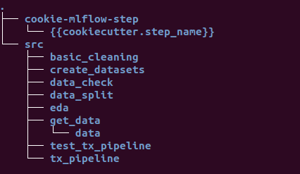
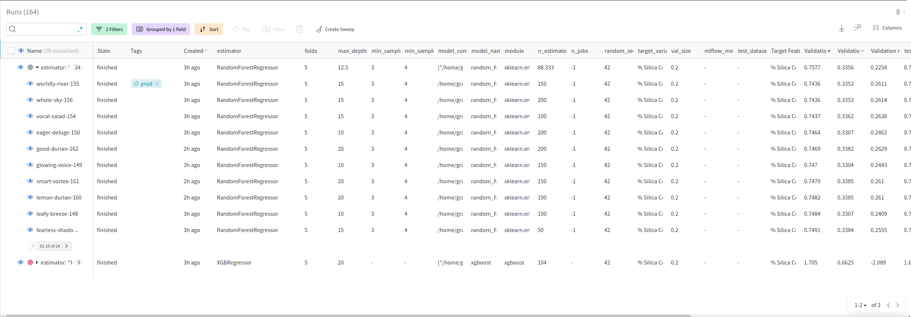

# Quality Prediction in a Mining Process

The main goal is to use this data to predict how much impurity is in the ore concentrate. As this impurity is measured every hour, if we can predict how much silica (impurity) is in the ore concentrate, we can help the engineers, giving them early information to take actions (empowering!). Hence, they will be able to take corrective actions in advance (reduce impurity, if it is the case) and also help the environment (reducing the amount of ore that goes to tailings as you reduce silica in the ore concentrate).

## Content

The first column shows time and date range (from march of 2017 until september of 2017). Some columns were sampled every 20 second. Others were sampled on a hourly base.

The second and third columns are quality measures of the iron ore pulp right before it is fed into the flotation plant. Column 4 until column 8 are the most important variables that impact in the ore quality in the end of the process. From column 9 until column 22, we can see process data (level and air flow inside the flotation columns), which also impact in ore quality. The last two columns are the final iron ore pulp quality measurement from the lab.
Target is to predict the last column, which is the % of silica in the iron ore concentrate.

## Quenstions to be answered

 1. Is it possible to predict % Silica Concentrate every minute?

 2. How many steps (hours) ahead can we predict % Silica in Concentrate? This would help engineers to act in predictive and optimized way, mitigatin the % of iron that could have gone to tailings.

 3. Is it possible to predict % Silica in Concentrate whitout using % Iron Concentrate column (as they are highly correlated)?

## The Project

 The solution for this tas may consist in two different approaches:

    - Tabular Regression Task
    - Time Series Forecasting

For the Tabular task, we need first to transform the time series we have into a tabular dataset. As the target feature is sampled on every hour, we approximate each feature using the median of its value during a given hour. Then, each resampled value on every hour will be an instance in the dataset. Additionally, it is known that the target feature takes one hour from the sample collection untill the laboratory results. Therefore, we lag the target feature in one hour, this way we try to capture or minimaze the error due to this time difference.

The time series we have for this task are measurements from sensors and data from the laboratory. As an example, below you may find some time series that represent some feautres:


Note that dataset consists from March 2017 until September 2017. In total, there are 24 columns and the first column shows time and date range (from march of 2017 until september of 2017). Some columns were sampled every 20 second. Others were sampled on a hourly base.

The second and third columns are quality measures of the iron ore pulp right before it is fed into the flotation plant. Column 4 until column 8 are the most important variables that impact in the ore quality in the end of the process. From column 9 until column 22, we can see process data (level and air flow) inside the flotation columns, which also impact in ore quality. The last two columns are the final iron ore pulp quality measurement from the lab. The Target is to predict the % of silica in the iron ore concentrate.

## Modeling

In this project we use frameworks such as [Mlflow](https://mlflow.org/) and [Weight & Biases](https://wandb.ai/) for experiment tracking and artifact storage. We also use the [Cookiecutter](https://github.com/cookiecutter/cookiecutter) command line utility to create our project with common components such as retrieving the data from a source, cleaning the data and creating training pipelines.

The project is designed in the following structure:



Each step consists in an important task:

__get_data__         -> Load the data from the source.

__basic_cleaning__   -> Create a cleansed dataset based on some conditions discovered during the data exploration part.

__create_datasets__  -> As we can have a tabular task or a time series task, we also use a step to create a tabular and a time series datasets called _ts_ and _tx_.

__data_split__       -> As the name suggests, this step is used to split the data into train/validation and test sets of the cleansed dataset.

__data_check__       -> To be implemented. But the idea is whenever new data comes, it will check the input data and alert the data scientist if a possible data drift might happen.

__tx_pipeline__      -> The the training step which consists in an estimator and preprocessing steps in a _sklearn pipeline_.

__test_tx_pipeline__ -> Given the best pipeline and the test dataset, we evaluate the model performance in a set of data never seen before.

## How to use

Once you cloned the repository, make sure to include the _.csv_ file from this [Kaggle Dataset](https://www.kaggle.com/datasets/edumagalhaes/quality-prediction-in-a-mining-process) into the data folder inside the __get_data__ step.

Then, create the _conda_ environment with all dependencies in the _environment.yml_ file:

```console
user@group:~$ conda env create -f environment.yml
```

As we are using the [Weight & Biases](https://wandb.ai/) framework, you have to create a new project and be sure you are logged in. In the _config.yml_ file there is a project name that you can change to adjust to the Weight & Biases project you have created.

```console
user@group:~$ wandb login
```

With the environment set and all python libraries ready, you can start interactiong with the project using the _mlflow_ command line interface. As an example, if you want to run the __get_data__, you should use:

```console
user@group:~$ mlflow run . -P steps=download
```

It is also possible to run multiple steps in one command. Now, we want to run all steps before the training:

```console
user@group:~$ mlflow run . -P steps=download,basic_cleaning,create_datasets,data_split
```

Finally, to run one training execution we can use the following command line:

```console
user@group:~$ mlflow run . -P steps=tx_pipeline
```

To evaluate a given model, we have to create a __tag__ named _prod_ in any model we want to evaluate. For example, we go to the project in the Weight & Biases tool and create a new tag:



Then, we can run the test pipeline with the model with a _prod_ tag.

```console
user@group:~$ mlflow run . -P steps=test_tx_pipeline
```

One interesting point of this modeling method is you can set as many hyperparameters as you want following the syntax below. In the example, we are training many instances of the _xgboost_ regressor with different set of hyperparameters. It is the same as using a __grid_search__ strategy to search for the best hyperameters.

```console
user@group:~$ mlflow run . -P steps=tx_pipeline -P hydra_options="main.models=xgboost modeling.xgboost.max_depth=5,10,15,20 modeling.xgboost.n_estimators=10,20,50,100,150,200 -m"
```

## Results

This project was developed as POC and the results should lead not to a final result, but to an understanding if a machine learning application may help the customer to improve its operation. Some questions were proposed and we try to answer them:

 1. Is it possible to predict % Silica Concentrate every minute?

    -__ans:__ It is possible, but not necessary. As the data we have for training has a sample by the hour and the operational parameters does not take imediate change into the process, we believe that a 5 or 10 minutes prediction for the next 10 or 15 minues would be enough for the operator to have more insights about operation. Today, the operator has one input every hour, and this input is late and does not represent the current situation. Then, using a machine learning to support a 10 or 15 minutes decision is important.

 2. How many steps (hours) ahead can we predict % Silica in Concentrate? This would help engineers to act in predictive and optimized way, mitigatin the % of iron that could have gone to tailings.

    -__ans:__ Predicting the next step or next hour would represent a huge operation improvement. I rather be conservative in this case and support the operational sector with a model to predict the next minutes or the next hour.

 3. Is it possible to predict % Silica in Concentrate whitout using % Iron Concentrate column (as they are highly correlated)?

    --__ans:__ As they are coming from the same analysis (one hour late) we can use only lagged % Iron Concentrate. But we the model might get unprecise signals since it is not clear when in time that specific concentration of iron was and which parameters are related to it. We prefere not using this feature to avoid data leakage.
